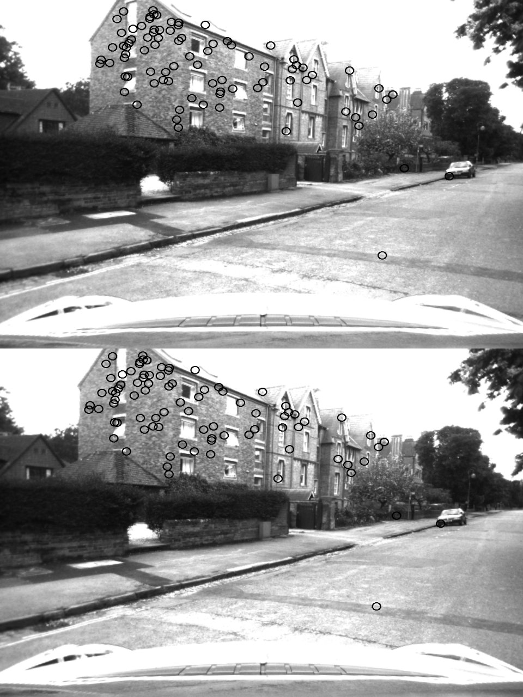

## Project - Visual Odometry
This project is an implementation of Visual SLAM - an SFM Approach

<em>Visual Odometry Demo, Source: gfycat</em>

## Dataset
The Project performs the Visual Odometry on Oxford dataset available at:
https://robotcar-dataset.robots.ox.ac.uk/documentation/

The dataset can be downloaded using this link https://drive.google.com/drive/folders/1f2xHP_l8croofUL_G5RZKmJo2YE9spx9

## Project dependencies
* Python 3.7
* opencv 3.4.2 
* Oxford Dataset

## Executing the project
From the src directory run the following command

`src/python3 visual_odom.py` 

## Point Correspondences after RANSAC

<em>Point correspondences between successive frames</em>

## Refrences
The following educational resources are used to accomplish the project:
https://cmsc426.github.io/sfm/

## Results
The project currently doesn't produce any visual results
